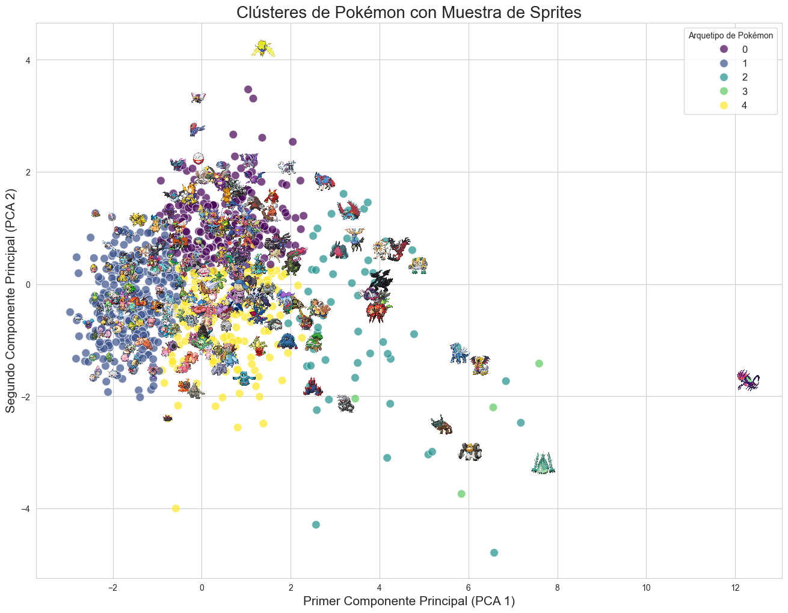

# Análisis Exploratorio de Datos (EDA) del Universo Pokémon

Este notebook presenta un análisis exploratorio profundo del dataset completo de Pokémon, abarcando más de 1000 criaturas a lo largo de todas sus generaciones. El objetivo es ir más allá de los datos superficiales para descubrir patrones, relaciones y arquetipos ocultos que definen el ecosistema Pokémon.

La narrativa de este análisis nos llevará desde las características de un Pokémon individual hasta las complejas interacciones entre sus estadísticas, tipos y roles de combate descubiertos mediante machine learning.

## 0. Inspección Inicial de Datos
**Objetivo:** Establecer una base sólida para el análisis, entendiendo la estructura, el tamaño, los tipos de datos y la calidad general del dataset recién construido.

**Hallazgos Clave:** El dataset contiene más de 1000 Pokémon, cada uno con 15 características. La única columna con una cantidad significativa de valores nulos es `type2`, lo cual es un comportamiento esperado, ya que muchos Pokémon tienen un solo tipo. No se encontraron otras anomalías evidentes en los datos.

## 1. Análisis Univariado: ¿Cómo es un Pokémon Promedio?
**Objetivo:** Analizar cada variable de forma aislada para entender la distribución de las estadísticas, la popularidad de los tipos y la composición de cada generación.

**Hallazgos Clave:** La mayoría de las estadísticas de combate (HP, Ataque, Defensa, Velocidad) se concentran en el rango de 50 a 100 puntos. Los tipos `Agua` y `Normal` son los más comunes, mientras que la Generación V fue la más prolífica en la introducción de nuevos Pokémon. El análisis también nos permitió coronar a los campeones de cada estadística, con Blissey (HP), Shuckle (Defensa) y Kartana (Ataque) en la cima.

## 2. Correlaciones y Promedios: ¿Qué Estadísticas van de la Mano?

**Objetivo:** Descubrir las relaciones entre las diferentes estadísticas numéricas e identificar qué tipos de Pokémon tienden a destacar en ciertos roles.

**Hallazgos Clave:** El heatmap de correlación reveló una fuerte relación positiva entre las estadísticas `height` y `weight`, pero una correlación negativa entre el ataque y la probabilidad de captura, confirmando la intuición de que los Pokémon más fuertes son difíciles de capturar. Al analizar los promedios, los tipos `Dragón` y `Acero` emergieron como las potencias estadísticas, mientras que los tipos `Bicho` generalmente se mostraron más débiles.

## 3. Análisis por Grupos: Profundizando en Tipos y Generaciones

**Objetivo:** Ir más allá de los promedios para comparar las distribuciones completas de estadísticas entre diferentes categorías, utilizando boxplots y violin plots.

**Hallazgos Clave:** Se confirmó que los Pokémon de tipo Dragón no solo tienen una media de ataque alta, sino que son consistentemente fuertes. El análisis de "power creep" mostró una tendencia clara al alza en las estadísticas totales en generaciones más recientes.

## 4. El Ecosistema de Tipos: Visualizando las Relaciones

**Objetivo:** Visualizar la compleja red de combinaciones de tipos duales para entender las sinergias más comunes.

**Hallazgos Clave:** El Diagrama de Cuerdas ilustró de manera efectiva que las combinaciones Normal/Volador y Planta/Veneno son de las más frecuentes, lo cual es consistente con la gran cantidad de Pokémon de estas características en las primeras rutas de los juegos.

## 5. Clustering: Descubriendo los Arquetipos de Combate

**Objetivo:** Utilizar aprendizaje no supervisado (K-Means) para ver si los datos mismos podían revelar "roles" o "arquetipos" de combate ocultos, basándose únicamente en las estadísticas.

**Hallazgos Clave:** El Método del Codo sugirió la existencia de 5 clústeres. La visualización con PCA mostró que estos grupos están razonablemente bien definidos, con un eje principal (PCA1) que representa el "Poder General" y un segundo eje (PCA2) que captura el balance entre "Agilidad vs. Masa/Robustez".

## Conclusiones y Futuras Líneas de Investigación

### La Historia de los Datos

Este análisis nos ha contado una historia de creciente complejidad. Empezamos viendo las piezas individuales del rompecabezas —las estadísticas y tipos de cada Pokémon— y terminamos ensamblando una imagen completa de su ecosistema. Descubrimos que la fuerza de un Pokémon no es aleatoria; está correlacionada con su peso, su tipo e incluso su estatus de "Legendario". Más allá de las etiquetas que les damos, los datos revelaron que los Pokémon se agrupan naturalmente en roles de combate distintos y estratégicos, arquetipos que cualquier jugador experimentado reconocería.

### Futuras Líneas de Investigación

Este EDA abre la puerta a nuevas y emocionantes preguntas que podrían ser resueltas con modelos de Machine Learning más complejos:

* **Clasificación de Legendarios:** ¿Podríamos entrenar un modelo que prediga con alta precisión si un Pokémon es Legendario basándose únicamente en sus estadísticas?

* **Relación Habilidades-Arquetipos:** ¿Existe una correlación entre las habilidades de un Pokémon (ej. "Intimidate", "Levitate") y el arquetipo de combate al que pertenece?

* **Predicción de Tipos:** Usando todas las estadísticas numéricas, ¿podríamos mejorar nuestro modelo original y predecir el tipo de un Pokémon con mayor precisión que usando solo el color?

* **Sistema de Recomendación:** ¿Se podría construir un recomendador que sugiera el Pokémon faltante para un equipo de combate, optimizando el balance de estadísticas y la cobertura de tipos?